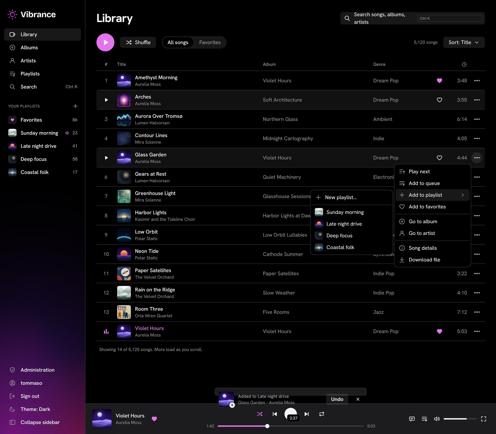
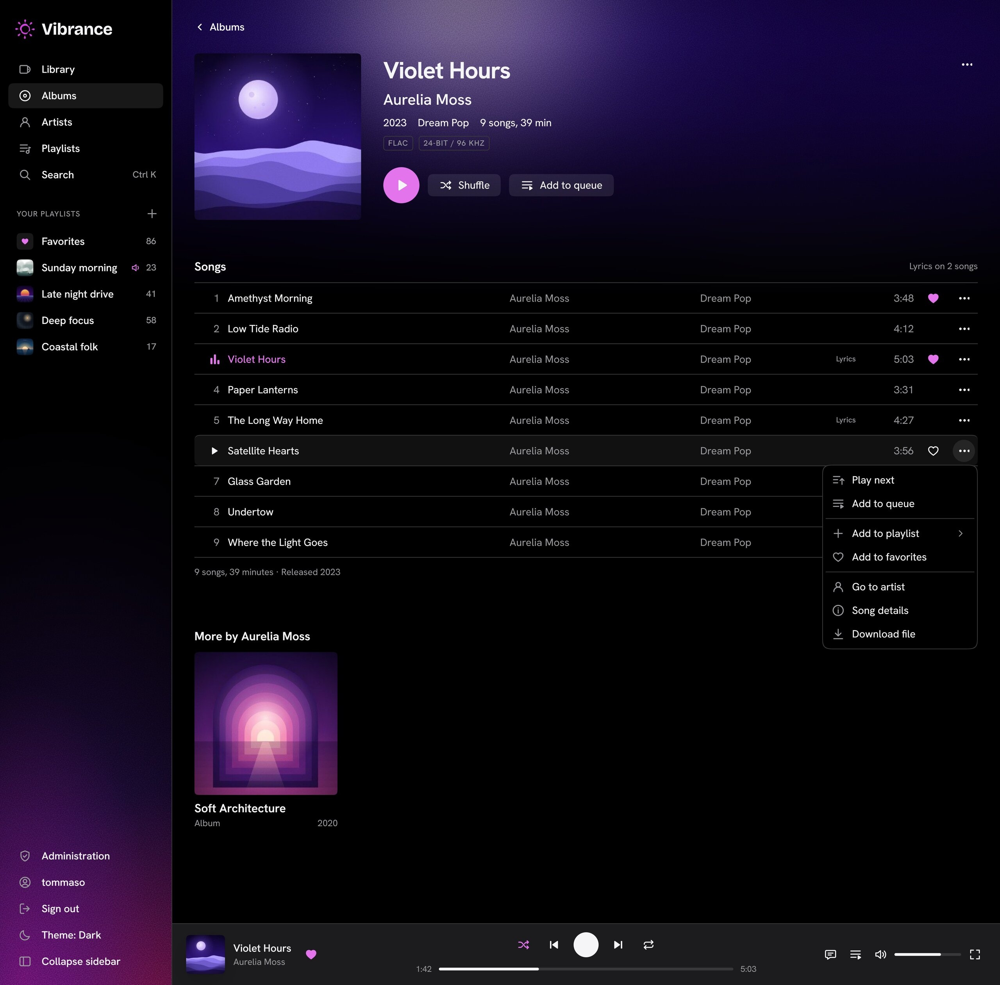
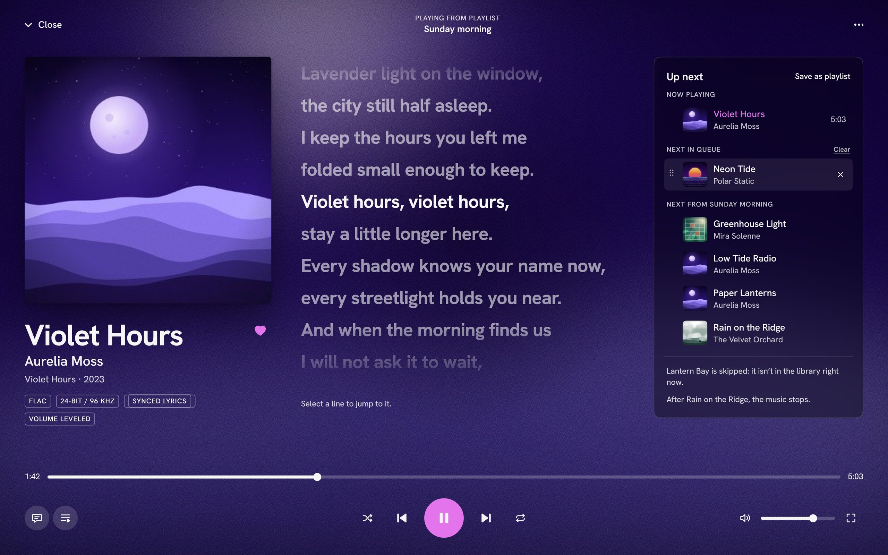

# Vibrance

Vibrance lets you and the people at home listen to the music collection that [Vibrance MusicLib](https://github.com/tommasonovelli/vibrance-musiclib) keeps tidy.

1. **MusicLib** imports your albums, lets you fix their metadata and writes a clean library folder.
2. **Vibrance reads that folder, and only reads it**: it keeps an index of your artists, albums and tracks up to date by itself, and never changes, moves or deletes a file.
3. **Everyone listens with their own account**, in the browser: browse the library, search as you type, play the original files with synchronised lyrics, and keep favorites and private playlists. Apps and scripts use the same [HTTP API](docs/api.md).

A track keeps its identity when you rename it, renumber it, retag it or move it to another album in MusicLib: playlists and favorites follow the audio. Vibrance is self-hosted, runs in Docker on a Linux machine next to MusicLib, and keeps working while MusicLib is stopped.







<sub>The artists, albums and covers in these screenshots are invented.</sub>

## Contents

- [Install](#install): five steps, from checking your machine to your first song
- [Everyday use](#everyday-use): start, stop, logs, backups, updates
- [The guide](#the-guide)
- [Building from source](#building-from-source)
- [Security](#security)
- [License](#license)

## Install

Vibrance is installed **together with MusicLib**, as one Docker Compose stack: MusicLib's own `compose.yaml`, unchanged, plus the `vibrance` service. Each step says what a good result looks like; the [operations guide](docs/operations.md) explains every step in more depth.

**Already running MusicLib?** Skip step 2 and follow [Adopting an existing MusicLib installation](docs/operations.md#adopting-an-existing-musiclib-installation): it keeps your containers, your volumes and your `.env`.

### 1. Check your machine

You need **Ubuntu 24.04 or later** on an **amd64** (x86-64) machine, **Docker Engine** with the **Compose v2** plugin (2.24 or later), usable without `sudo`, **local ext4 storage**, and `curl` and `openssl`. Docker Desktop, NAS, network filesystems and ARM machines are **not supported**.

```sh
uname -m                                   # must print x86_64
docker compose version                     # prints "Docker Compose version v2...." (2.24 or later)
findmnt -no FSTYPE -T /var/lib/docker      # must print ext4
```

If a check fails, or to keep MusicLib's data in a folder of your choice, read [What you need](docs/operations.md#what-you-need) **before** step 2.

### 2. Install and start

Paste this block into a terminal. It creates `~/musiclib`, downloads the two files of the latest release, writes three random passwords into `.env`, and starts MusicLib and Vibrance:

```sh
mkdir -p ~/musiclib/import && cd ~/musiclib
[ -e compose.yaml ] || curl -fsSLO https://github.com/tommasonovelli/vibrance/releases/latest/download/compose.yaml
[ -e .env ] || { curl -fsSL -o .env https://github.com/tommasonovelli/vibrance/releases/latest/download/env.example && chmod 600 .env && sed -i "s/^POSTGRES_PASSWORD=.*/POSTGRES_PASSWORD=$(openssl rand -hex 32)/" .env && sed -i "s|^MUSICLIB_PASSWORD=.*|MUSICLIB_PASSWORD=$(openssl rand -base64 24)|" .env && sed -i "s|^VIBRANCE_ADMIN_PASSWORD=.*|VIBRANCE_ADMIN_PASSWORD=$(openssl rand -base64 24)|" .env; }
docker compose up -d --wait
```

The first time, Docker downloads the images; the last command returns when everything is ready. A good result:

```sh
docker compose ps                                    # the three containers show "healthy"
```

- **Run every command of this README from `~/musiclib`** (`cd ~/musiclib`).
- The block is safe to paste twice: it never replaces an existing `compose.yaml` or `.env`. `.env` holds the passwords: keep it private.
- If a container is unhealthy, `docker compose logs --tail=20 vibrance` (or `app`, for MusicLib) shows a line with a `code`: look it up in [Troubleshooting](docs/operations.md#troubleshooting).

### 3. Import an album in MusicLib

Open **<http://127.0.0.1:8080>** (exactly this address: `localhost` is refused) and sign in with MusicLib's password, `grep MUSICLIB_PASSWORD .env`. Copy an album folder into `~/musiclib/import` and choose **Import everything in …** on the **Import** page. [MusicLib's README](https://github.com/tommasonovelli/vibrance-musiclib#install) explains its side.

### 4. Sign in to Vibrance and play

Open **<http://127.0.0.1:8090>** (exactly this address) and sign in as `admin`, with the password after `=` in:

```sh
grep VIBRANCE_ADMIN_PASSWORD .env
```

Vibrance looks at MusicLib's library when it starts and then every 5 minutes, so your album appears a few minutes after MusicLib has written it. Not there yet? Open **Administration** in the sidebar and choose **Scan library**. A good result is your album under **Albums**: select it and press play.

On a machine without a desktop, open both addresses from your computer through an SSH tunnel: `ssh -L 8090:127.0.0.1:8090 -L 8080:127.0.0.1:8080 you@server`.

### 5. Add the people who listen

Nobody can sign up alone: in **Administration**, choose **New user** for each person, and give them their name and password. Then, if they listen from other devices, follow [Access from other devices](docs/operations.md#access-from-other-devices).

> **Over plain HTTP the passwords cross the network in clear**: use your home network only if you trust it, and never expose the ports to the Internet.

Every setting, from the backup folder to the scan interval, is in [Configuration](docs/operations.md#configuration).

## Everyday use

| Task | Command |
|---|---|
| Stop everything | `docker compose stop` |
| Start it again | `docker compose up -d --wait` |
| Show the status | `docker compose ps` |
| Read Vibrance's log | `docker compose logs --tail=100 vibrance` |
| Back up Vibrance | `docker compose exec vibrance vibrance backup --to "/backup/$(date +%F-%H%M)"` |

The stack starts again by itself after a reboot, unless you stopped it. More commands: [Everyday commands](docs/operations.md#everyday-commands).

> **Never run `docker compose down -v`: it deletes your library, both databases and the backup volumes.** To stop the stack, use `docker compose stop`.

- **Back up both products.** Vibrance's database holds the accounts, favorites and playlists, and cannot be rebuilt from the library; MusicLib has its own backup. See [Backups, restore and moving](docs/operations.md#backups-restore-and-moving).
- **Update only with Vibrance's releases**, never with MusicLib's own `compose.yaml`: each release names the MusicLib version it was tested with and updates both. The block that backs up and updates is in [Upgrading](docs/operations.md#upgrading).

## The guide

- [Running Vibrance](docs/operations.md): what it does and doesn't do, configuration, accounts, access from other devices, backups, upgrades and troubleshooting.
- [Using the API](docs/api.md): the main requests with `curl`; the full reference is the page Vibrance serves at `/api/docs`, from [api/openapi.yaml](api/openapi.yaml).
- [MusicLib compatibility](docs/compat.md): which MusicLib each Vibrance was tested with.
- [CHANGELOG.md](CHANGELOG.md): what each version changed.

## Building from source

The image holds one Go program, with the web interface built in, and the `ffmpeg` and `ffprobe` of MusicLib, all pinned to exact versions; its database is one SQLite file. Everything is built and tested in Docker: `docker build --target runtime -t vibrance:local .` builds the image from a clone. Development, tests and releases are in the [developer guide](docs/development.md); to contribute, read [CONTRIBUTING.md](CONTRIBUTING.md).

## Security

Vibrance is made for a home network or a private name behind HTTPS, not for the open Internet. To report a vulnerability, read [SECURITY.md](SECURITY.md): please do not open a public issue for it.

## License

Vibrance's code and documentation are released under the [MIT License](LICENSE), copyright 2026 tommasonovelli.

The sun logo is the author's artwork and is **not** covered by the MIT License: you may keep it in unmodified copies, but a modified version you distribute must use its own symbol. See [The sun symbol](web/ui/VENDOR.md#the-sun-symbol).

Third-party software and assets keep their own licenses. [THIRD_PARTY_NOTICES.md](THIRD_PARTY_NOTICES.md) lists everything the Docker image contains, with versions, licenses and where to get the sources; it is also in the image, under `/usr/share/doc/vibrance/`, with the license texts. Each GitHub release attaches it together with the source tarball of FFmpeg.
